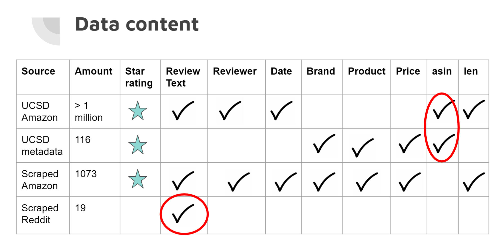
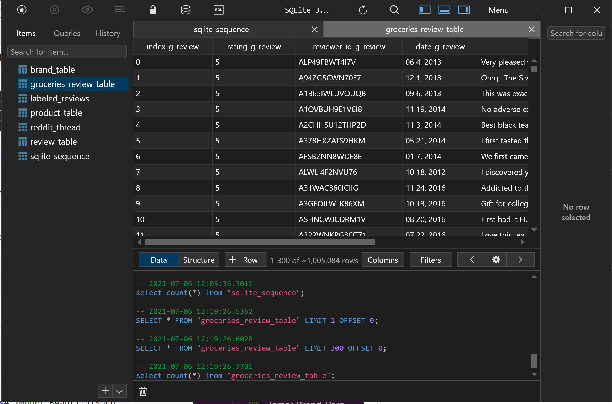
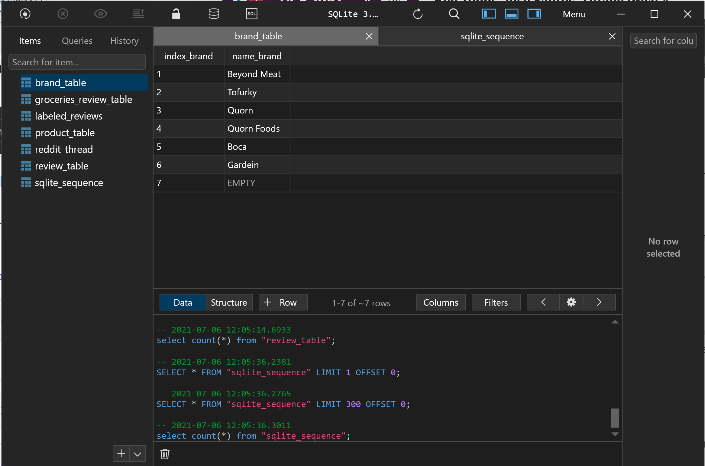
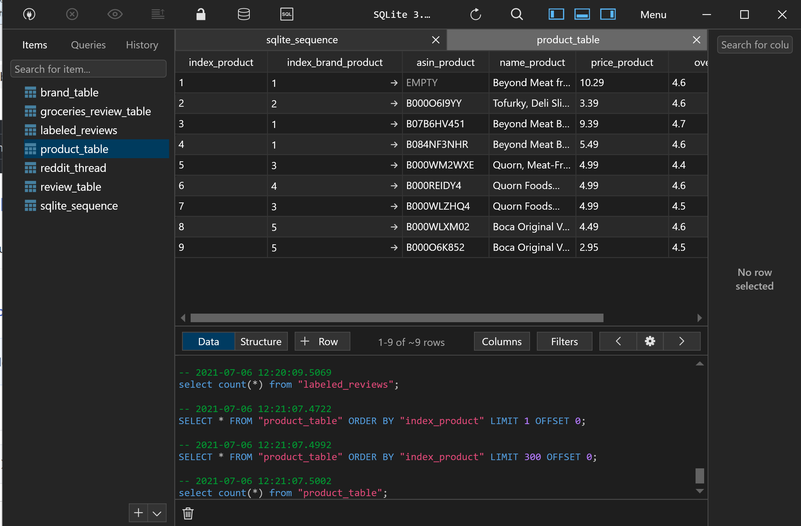
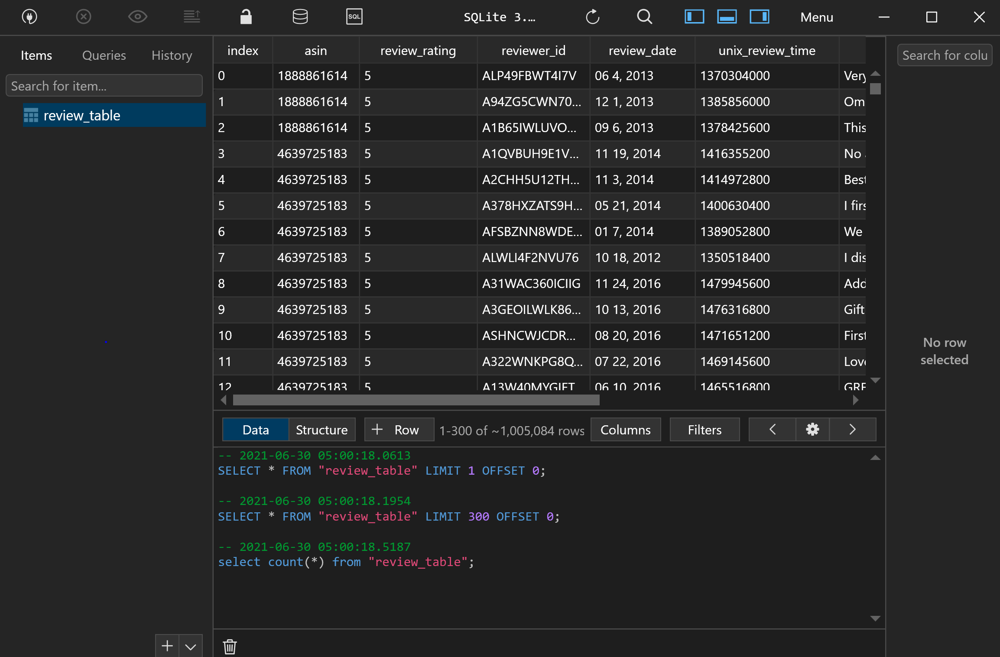
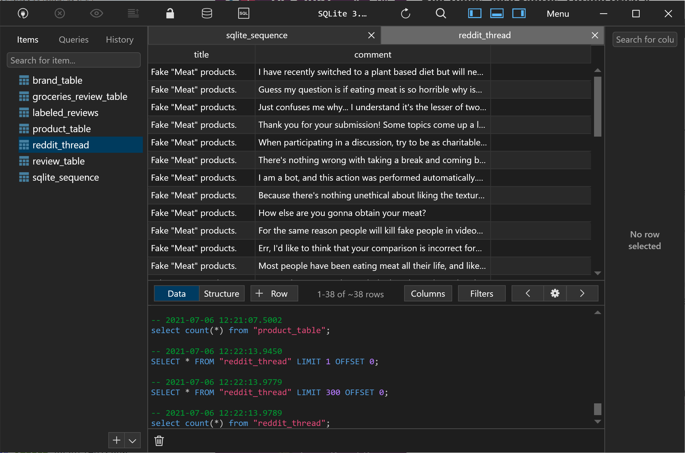
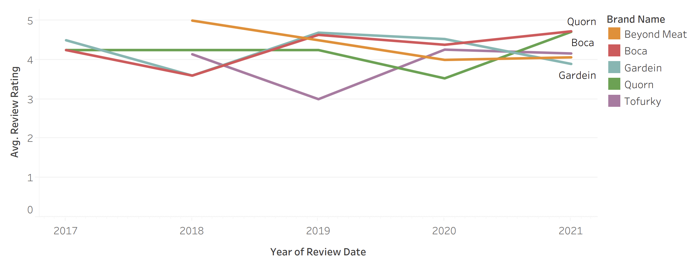
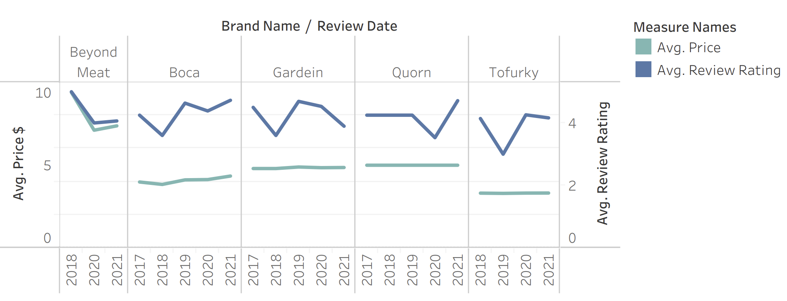

# Project One - Artificial Meat Review Predictions

### Group #3 Members 
 - Tamar Brand-Perez
 - Tiffany Price
 - Ben Tubbs
 - Jose Santos

## Topic

The topic of our project involves artificial meat review predictions.  

## The Why

We selected this topic because the artificial meat industry is becoming increasingly popular as of late.  We find the industry very interesting and want to understand how consumer experience and resulting reviews can predict ratings. After pulling and cleaning our data set from Amazon, we used the Natural Language Processing machine learning model to train a sentiment classifier. During the cleaning process, both five and one star reviews were maintained, while two, three and four star ratings were removed.  Next, we pulled reviews without ratings and directed the machine to predict the ratings based on its analysis of the reviews.  

## Data Source

We used three main sources of data:

- Our initial dataset was pulled from the Amazon Grocery and Gourmet Food section from the computer science lab website of Dr. Jianmo Ni, at UCSD (http://deepyeti.ucsd.edu/jianmo/amazon/index.html). This dataset was of groceries. 
- We scraped Amazon's website. This data included fake meat brands only. 
- We scraped Reddit reviews. This data was of fake meat reviews only as well. 

## Data Content

### Image of data content:

We wanted a dataset that had all of the columns mentioned in the image above and most importantly, the review text as well as the product and price information because we wanted to focus only on fake meat reviews. Since the dataset from UCSD had groceries reviews but no product and brand information, we tried to merge it with the metadata that was supposed to belong to it. 

The general groceries dataset from UCSD had more than 5 million reviews. After cleaning the data we had more than 1 million reviews. The metadata had a similar number initially but after choosing only the fake meat reviews, the metadata set had only 116 reviews. Then when we merged the UCSD Amazon data with the metadata we were left with only 12 rows. We tried many different variations of merge, join, concatenate, with an inner, outer, left joins with no success. The only common column in these datasets was the asin which is the Amazon’s product number. When we looked further into the data we found that the asin in one of the datasets was made of letters and digits and the other one was digits only so this explained why the merging of these datasets did not work. 

So we decided to shift to scraped data from Amazon website. When scraping we had to input multiple url’s to get the data. We got all the necessary information and used it for visualizations. 
Scraped data was specifically about fake meat products. 

The reddit reviews did not have star ratings. We scraped the reddit reviews about fake meat to show that our machine learning model could predict if a review is positive or negative therefore expanding the number of reviews that store owners could use to help them in understanding how people feel about different fake meat products and ultimately, help them decide which brands and products they may want to sell in their stores. 

## Data Cleaning

We dropped columns that were not relevant for our goal:(columns that were dropped were: verified, reviewer name, summary of the review text, unix review time, (vote, image and style - had little data in them)).

We added the review length column because we were going to find out if there was a connection between the length of a review and its sentiment (We ended up not using that). This column showed the number of words in each review. 

We dropped duplicate rows, that is rows that all data was identical were dropped. 
We narrowed the data to include only the 1 and 5 starred reviews so the difference between the positive and negative was more obvious. 
We trimmed the 5 star reviews from more than 3 million reviews to 600,000 to match the number of reviews we had for 1 star to feed a balanced set into the machine learning model. 

## Database 

We used Sqlite and sqlalchemy to create the database. This was a local database that is suitable for the development stage of a project. 
We interacted with the database using python, and table plus. 
Below is an image of the ERD we created, showing the tables in the database. The first one is the data from UCSD Amazon general groceries. (We did not include the metadata because we ended up not using it.) The three in the middle are from the Amazon scraped data. The first one is of the brands. The second is the products. Since each brand has several products, the connection is one to many. Since each product has multiple reviews the connection between the product and the review table was also one to many. Lastly we have the reddit thread table with Reddit reviews. 

## Link to the data files:

### reviewdb.db: sqlite database which includes 5 tables: groceries_reviews is the original dataset. brand, product and review tables are from the scraped amazon data and reddit_thread is from the Reddit scraped data: 

https://drive.google.com/file/d/1dmxUiRXfJX1dMDdqdZdfr-iHuozO44Q1/view?usp=sharing

### Image of ERD describing database tables

### Images of Database Tables in Table Plus:

#### Groceries review Table

#### Brand Table

#### Product Table

#### Review Table

#### Reddit Thread Table

### Image of Join Query on Table Plus

## Goals

In this project the goal was to use a Natural Language Processing machine learning model to train a sentiment classifier on an Amazon dataset of Grocery and Gourmet Food reviews (https://jmcauley.ucsd.edu/data/amazon/) containing over 1 million reviews.  

The questions our team hoped to answer with this data:
We wanted to collect information about fake meat and provide it to stakeholders so they can make informed decisions. We wanted to provide a better understanding of how people feel about fake meat products:
- Did a fake meat product receive a positive or negative review?
- What are some keywords that users use to describe specific products, which may provide insight into what characterizes a specific product in the eyes of reviewers. 
- Did the price of these fake meat products change over time?
- Did the rating of these products change over time?

All of this information would be provided to groceries store owners to help them decide which products and brands would be best to sell in their stores. 

## Algorithm

The algorithm uses a bag of words model and a Naive Bayes classifier.  

### Preprocessing and Normalization

The following preprocessing and normalization steps were taken before creating the labeled data set.  Each is explained in greater detail below.

* Tokenized
* Converted to Lowercase
* Removed Non Alphanumerics
* Removed Items Less Than Two Characters
* Removed Stop Words
* Lemmatized

The data was tokenized which means that each sentence was divided into a Python list where the entries are each of the items in the sentence.  Items meaning words that are split smartly so that words such as Mr. are kept together, but periods at the end of the sentence are treated as their own item.  
  
Everything was converted to lowercase.  
  
Everything that was not an alphanumeric was removed leaving only numbers and letters.  
  
All tokens that were less than two characters in length were removed.  
  
Stop words are words such as "in", "for", "that", and "the" which do not add a lot of meaning to the text.  Stop words were also removed.  
  
The words were them lemmatized which means that the same words of different forms were normalized to the same form.  An example of this would be words like "eat", "eats", "ate" and "eaten" are all normalized to "eat".

### Feature Set

After we have our set of normalized words, we had to create our labeled data set to feed in the algorithm.  Each of the reviews was converted into a Python dictionary with words as the keys and boolean values of as the values.  The keys of the dictionary was the entire feature set which consisted of the 3000 most common words found in all of the reviews.  The boolean values were set to True if the review contained that word and False otherwise.  
  
Next, we shuffled the positive reviews and created a list of 1000 positive and 1000 negative reviews which was again shuffled.  This list of 2000 reviews which is each a hashmap of presence or absence in each individual review of the 3000 most common words in all of the reviews is the feature set that was used to train the model.  Note that this "bag of words" model does not take into consideration word order.

### Machine Learning

A Naive Bayes classifier was used to train the model.  The Bayes model works on the equation P(A | B) = P(B | A) * P(A) / P(B).  The algorithm works by taking in the labeled data and slowly moving each of the words more positive if the word appears in a positive review and more negative if the word appears in a negative review.  At the end of this training, the algorithm is left with percentages for how positive or negative each word is.  
  
We then make our naive assumption.  Rather than calculating the full review text, we calculate each of the words in the review and multiply the probabilities together.  For example, rather than calculating P(fake meat is disgusting | Positive) we would calculate P(fake | Positive) * P(meat | Positive) * P(disgusting | Positive) (Stop word removed).  We do the same for the negative probability and then decide which is larger.  This is how the algorithm classifies reviews.

### Interactive Website/Dashboard

LINK TO VIDEO

## Visualizations
### Price v. Year

### Rating v. Year

### Review v. Price per Year by Brand

## Presentation
A copy of the draft slides has been uploaded to our repository.  You can also link to the presentation here .

## Dashboard

The dashboard consists of eight pages that demostrate the work that we have put into this project.  These pages include:

* Project
* Database
* Machine Learning Model
* Amazon Review Scraper
* Reddit Thread Scraper
* Review Classifier
* Visualizations
* Presentation

### Project Page

The project page gives and overview of the project, the questions to be answered, and the goals of the project.

### Database Page

The database page includes information about where the data was collected from as well as how it was stored in the database.

### Machine Learning Model

The machine learning page includes information about the preprocessing of the data, the featureset creation, the training of the model, and the way in which the model predicts information.  This is the first page with an interactive feature which allows the user to use an alternate sample to train the model.  All of the tables on this page as well as the accuracy will be updated dynamically based upon the new sample of data.

### Amazon Review Scraper

This page allows the user to enter an Amazon product page and then it will scrape some information about the product such as the title and price as well as the first few pages of reviews.  The reviews will also be classified by the algorithm and the classification displayed in a table.

### Reddit Thread Scraper

This page allows the user to enter a Reddit thread.  The comments will be scraped from the thread and classified by the algorithm.  Statistics are then calculated about the thread such as the number of reviews, the number of positive and negative reviews as well as the percentage of positive and negative reviews.

### Review Classifier

The next page allows the user to enter in any text that he or she would like and the algorithm will classify it and display the text as well as the classification.

### Visualizations

The next page contains an interactive image carousel of several of the visualizations that we created throughout the completion of the project.

### Presentation

The final page shows the presentation, and it is downloadable as a PDF or PPTX document.

### Conclusion
#### Results
In conclusion, our hope is to facilitate increased sales of artificial meat products by way of empowering store owners in their decision making process of which products/brands to sell.  Our ML model predicts the sentiment of user entered reviews with approximately 82% accuracy.  We have seen a range of 80-84% depending on which data is used to train the model.

Also, through use of our interactive website, stakeholders have the ability to understand customer sentiment upon testing reviews.
Finally, from the word clouds and the table analysis of the reviews, the stakeholder will be able to associate specific product description words with the respective brand. This allows for a deeper understanding of how customers choose to comment about a specific product and brand. 

#### Limitations
The limitations we experienced during our analysis include:
 - Our time frame was rushed; as were learning about the limitations of our data set, we were already using it. 
 - Since our initial data set was limited, we were not necessarily focused on the best data set available.  We operated with what we had and made the most of it due to time and resource constraints, including but not limited to, computer capacity and also eventually being blocked by Amazon during our web scraping.
 - Finally, the algorithm does not consider the order of words (ie food is bad not good v food is good not bad).

#### Further Analysis
If we were to continue future analysis, we would:
 - Include more interactive visualizations for the end user.
 - Scrape in a larger data set, as available.
 - Pull in location data of reviews to further enable stakeholders’ insight into consumer sentiment by location. This would allow for more market focused guidance. 

#### Ways to Improve Project
 - We would search for a more accurate algorithm
 - We would have our algorithm consider word order
 - Finally, we would host our website on a server
